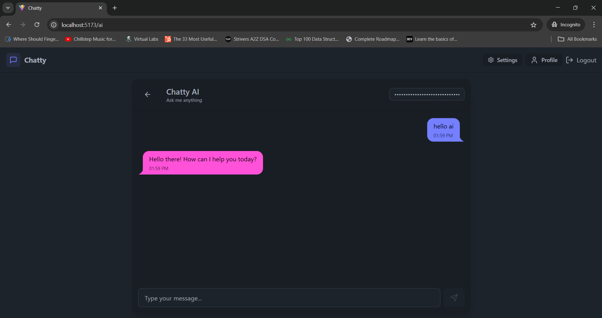
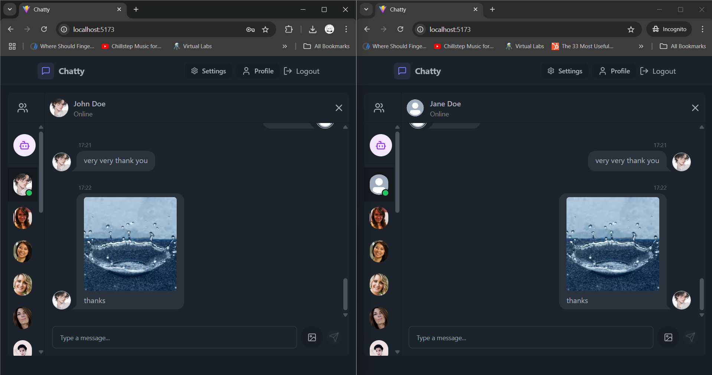
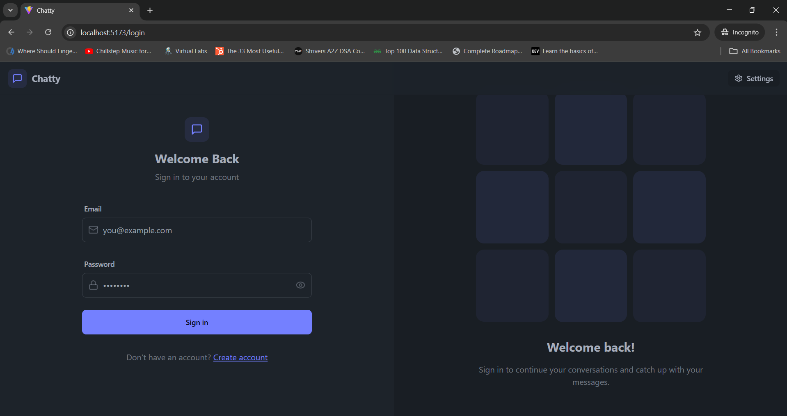
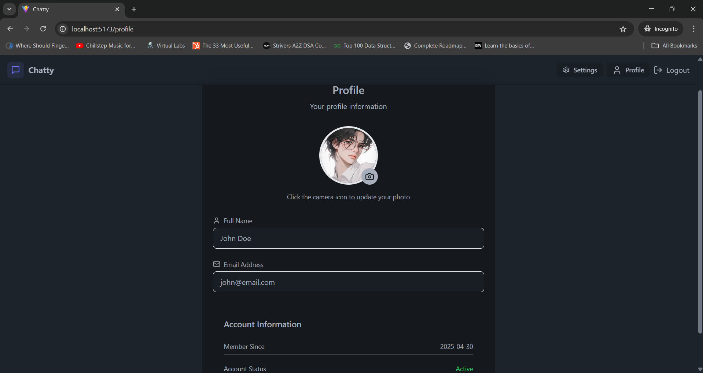
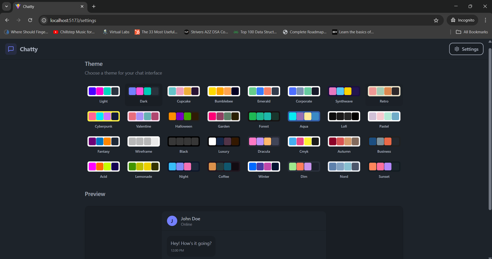

# 💬 Chatty — Real-Time Chat App with AI

**Chatty** is a modern, real-time one-on-one chat application powered by the **MERN stack** with **Socket.IO** for WebSocket-based communication and **Gemini AI** for assisting users in composing and editing messages. The platform offers a clean UI, theme customization, user profile management, and secure authentication.

---

## 🚀 Features

- 🔁 Real-time messaging using **Socket.IO**
- 🤖 AI-assisted text composition and editing with **Gemini AI**
- 🟢 Online/offline user status detection
- 🔍 Filter/search for online users
- 🎨 Customizable UI themes (light/dark/cyberpunk, etc.)
- 👤 Profile page with editable avatar, email, and join date
- 🔐 Secure authentication with **JWT** and **bcryptjs**
- ☁️ Image upload via **Cloudinary**

---

## 🧑‍💻 Tech Stack

### Frontend
- **React** (with Vite)
- **TailwindCSS** & **DaisyUI**
- **React Router**, **Zustand**, **Axios**
- **Socket.IO Client**, **Lucide-React**

### Backend
- **Node.js**, **Express.js**
- **Google Gemini AI API**
- **MongoDB** with **Mongoose**
- **Socket.IO**, **JWT**, **bcryptjs**
- **Cloudinary** for image hosting
- **cookie-parser**, **cors**, **dotenv**, **nodemon**

---

## 📸 Screenshots

| AI Chat | Real-Time Chat |
|--------|----------------|
|  |  |

| Login Page |
|----------- |
|  |

| Profile Page | Settings Page |
| -------------|----------------|
|  |  |

---

## ⚙️ Installation

### 1. Clone the Repository
```bash
git clone https://github.com/apoorv654123/Chatty.git
cd Chatty
````

### 2. Backend Setup

```bash
cd server
npm install
```

* Create a `.env` file in `/server` and add:

  ```
  PORT=5000
  MONGODB_URI=your_mongo_uri
  JWT_SECRET=your_jwt_secret
  CLOUDINARY_CLOUD_NAME=your_cloud_name
  CLOUDINARY_API_KEY=your_api_key
  CLOUDINARY_API_SECRET=your_api_secret
  ```

```bash
npm run dev
```

### 3. Frontend Setup

```bash
cd ../client
npm install
npm run dev
```

---

## 🛡️ Security

* Passwords are hashed using `bcryptjs`
* Authentication handled via `jsonwebtoken` and secure HTTP-only cookies
* Sensitive data protected via environment variables (`dotenv`)

---

## 📈 Future Scope

* ✅ Group chats
* ✅ Voice and video calls
* ✅ Emoji and file sharing
* ✅ Message reactions and notifications
* ✅ AI-powered summarization and auto-reply

---

## 📄 License

MIT License.
Feel free to fork, contribute, or suggest improvements.

---

## 🙌 Acknowledgements

Thanks to:

* [Google Gemini](https://ai.google/discover/gemini/)
* [Cloudinary](https://cloudinary.com/)
* [Socket.IO](https://socket.io/)
* [TailwindCSS](https://tailwindcss.com/)
* [DaisyUI](https://daisyui.com/)

---

## 💡 Final Thoughts

> *"Confidence comes from building. Clarity comes from shipping."*
> Start small, keep building, and launch often. 🚀
